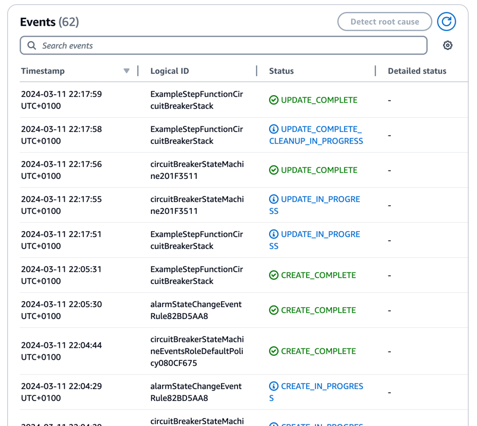
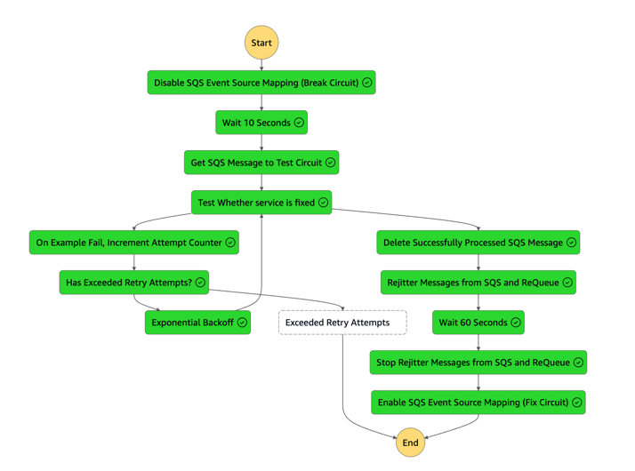
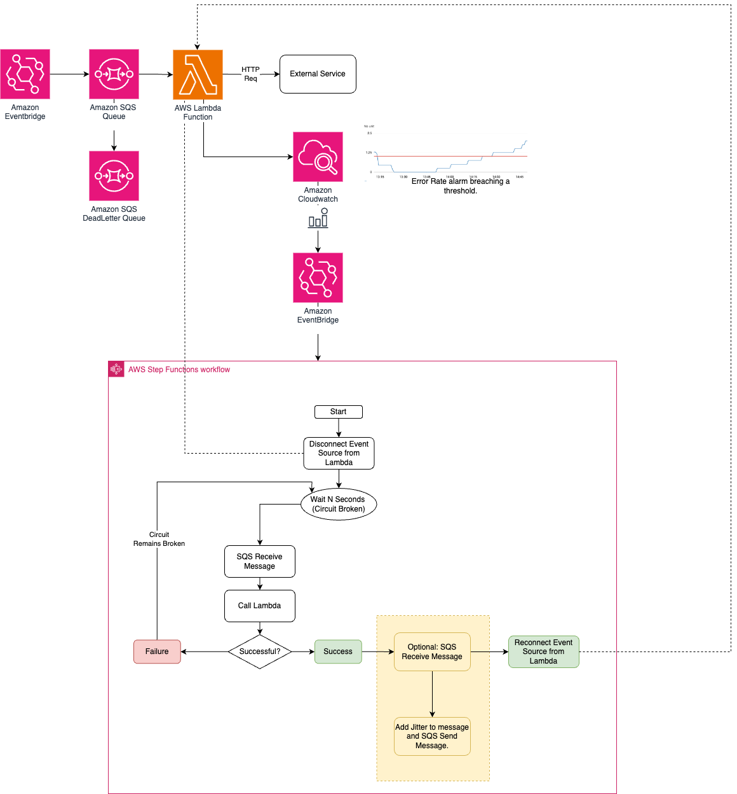
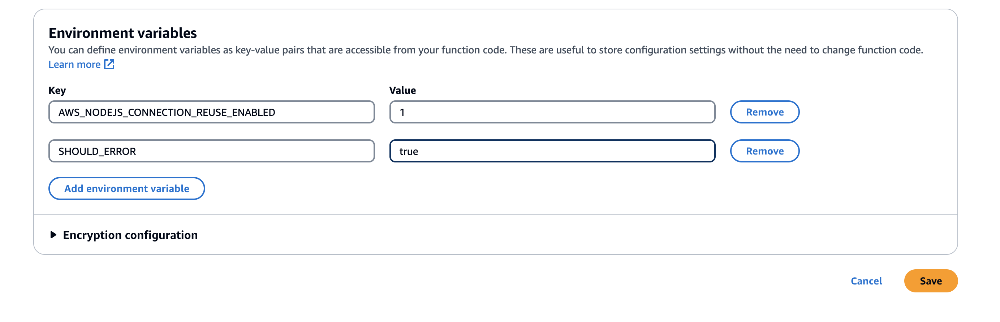
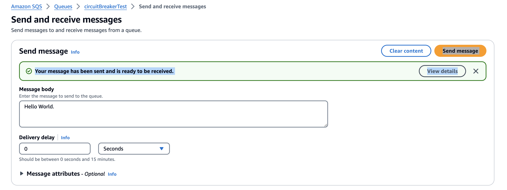
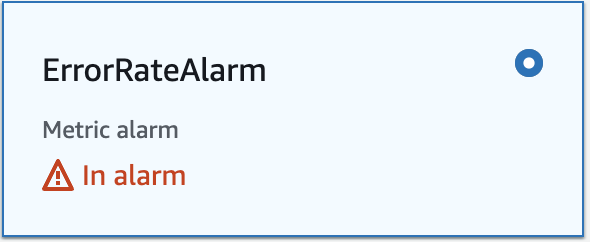
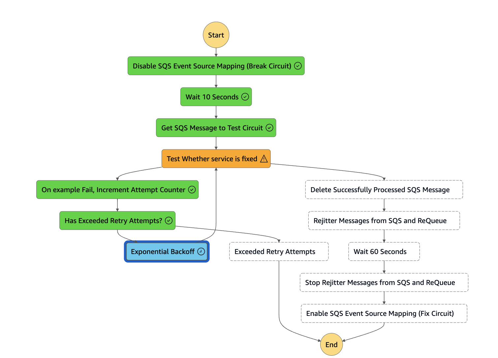
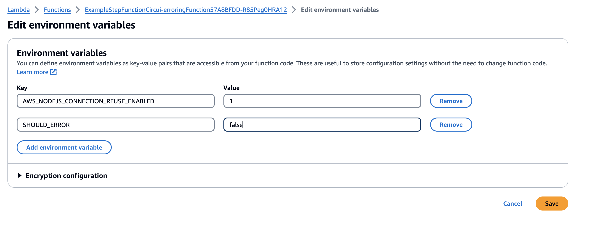

# Circuit Breaker for Amazon SQS Event Source Lambdas.

Circuit Breakers are a design pattern used in Software Development to allow a failing piece of your architecture, such as an external API, time to recover from any failures.

The circuit breaker pattern can prevent a caller service from retrying a call to another service (callee) when the call has previously caused repeated timeouts or failures. The pattern is also used to detect when the callee service is functional again.

This repository implements a Circuit Breaker pattern for an event driven Lambda, sourcing it's events from [Amazon SQS](https://aws.amazon.com/sqs/). It uses an [AWS CDK](https://aws.amazon.com/cdk/) construct in order to achieve this.

To learn more about the Circuit Breaker pattern and other patterns, please refer to the Amazon Prescriptive Guidance page on [Cloud Design Patterns, architectures, and implementations.](https://docs.aws.amazon.com/prescriptive-guidance/latest/cloud-design-patterns/circuit-breaker.html)

## Prerequisites

For this tool, you need:

- An [AWS](https://signin.aws.amazon.com/signin?redirect_uri=https%3A%2F%2Fportal.aws.amazon.com%2Fbilling%2Fsignup%2Fresume&client_id=signup) account
- Access to the following AWS services: [AWS Lambda](https://aws.amazon.com/lambda/), [AWS Step Functions](https://aws.amazon.com/step-functions/), [Amazon SQS](https://aws.amazon.com/sqs/), [Amazon Cloudwatch](https://aws.amazon.com/cloudwatch/), and [Amazon EventBridge](https://aws.amazon.com/eventbridge/)
- [Node.js](https://nodejs.org/en/download/) installed

## Setting up the environment

For this walkthrough, use the [AWS CDK](https://aws.amazon.com/cdk/) code in the GitHub Repository to create the AWS resources. These include IAM roles, AWS Lambdas, AWS Step Functions, Example Amazon SQS Queues, Example AWS Lambda, and Cloudwatch Alarms.  

1. You need an AWS access key ID and secret access key for configuring the AWS Command Line Interface (AWS CLI). To learn more about configuring the AWS CLI, follow these [instructions](https://docs.aws.amazon.com/cli/latest/userguide/cli-chap-install.html).
2. Clone the repo: 
```bash
git clone https://github.com/aws-samples/serverless-circuit-breaker-stepfunctions.git
```
3. Bootstrap the CDK Environment if not previously performed
```bash
cdk bootstrap
```
4. The cdk synth command causes the resources defined in the application to be translated into an [AWS CloudFormation](https://aws.amazon.com/cloudformation/) template. The cdk deploy command deploys the stacks into your AWS account. Run:
```bash
cd cdk 
cdk synth 
cdk deploy
```
5. CDK deploys the environment to AWS. You can monitor the progress using the CloudFormation console. The stack name is ExampleStepFunctionCircuitBreakerStack:
   


## How it works 

The repository also gives a working example of utilising this AWS CDK Construct.

This example uses a Cloudwatch Alarm, triggered by consistent failure of a AWS Lambda function. It then uses Amazon EventBridge to capture this, and create a AWS Step Function workflow. an example AWS Lambda function is provided, that merely errors when an environment variable flag is set. 

This workload also contains an optional feature, which is the rejittering of messages. One common problem that can occur after turning your circuit back on is the sudden flux of new messages can overwhelm the service. By rejittering these messages it ensures that they are spaced out, and that the downstream service is not hit with a retry storm.  

The workflow does the following: 

* Disables the Amazon SQS Event Source for the Target Lambda.
* Waits N Seconds (You are able to define this)
* Retrieves a single message from an Amazon SQS Queue, to be used as a way to test the Lambda.
* On Failure: 
  * Backs off, and retries at a later time. Does so until it has exceeded its number of allowed retries, or until the downstream service is fixed.
* On Success:
  * Deletes the Test SQS Message
  * Optional (Rejitter): 
    * Assigns a Lambda, that is driven by the Amazon SQS Event Source
    * Takes all messages, and adds a random rejitter delay to them, and then reques them
  * Reactivates the Amazon SQS Event Source, effectively opening the circuit.
 


## Technologies used

* Typescript - Used for both the AWS CDK, and the example lambdas.
* Amazon SQS - Used as both an Event Source for the example lambda, and used to reprocess the incoming events. 
* AWS Step Functions - Variety of Step Function Tasks used in order to accomplish the logic for the Circuit Breaker. 
* AWS Lambda - Used to drive the messages to the external service, and also to rejitter messages back into the Amazon SQS Queue. 

## Architecture 



## Testing

* The AWS Lambda function uses an environment variable - `SHOULD_ERROR` - to force a failure. Set this environment variable to true.
  * 
* Add some Amazon SQS Messages to the Queue.
  * 
* The AWS Lambda Function will fail these requests, triggering the Cloudwatch Alarm
  * 
* This will invoke the AWS Step Function, which will enter into the Exponential Backoff section.
  * 
* Change the Environment Variable of the AWS Lambda Function back to false, indicating that the lambda should successfully execute
  * 
* This will allow the AWS Step Functions to complete normally, re-enabling the event source and processing the messages. 
  * 

## Cleaning up

To avoid incurring additional charges, clean up all the resources that have been created. Run the following command from a terminal window. This deletes all the resources that were created as part of this example.

```bash
cdk destroy
```

## Security

See [CONTRIBUTING](CONTRIBUTING.md#security-issue-notifications) for more information.

## License

This library is licensed under the MIT-0 License. See the LICENSE file.

## AWS Prescriptive Guidance
To see the prescriptive guidance for Circuit-Breakers on AWS, and other cloud design patterns visit the blog at 
 [https://docs.aws.amazon.com/prescriptive-guidance/latest/cloud-design-patterns/circuit-breaker.html](https://docs.aws.amazon.com/prescriptive-guidance/latest/cloud-design-patterns/circuit-breaker.html)